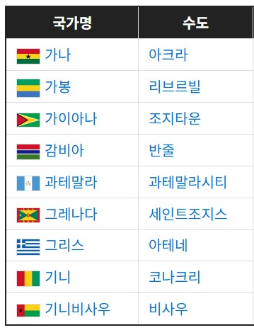
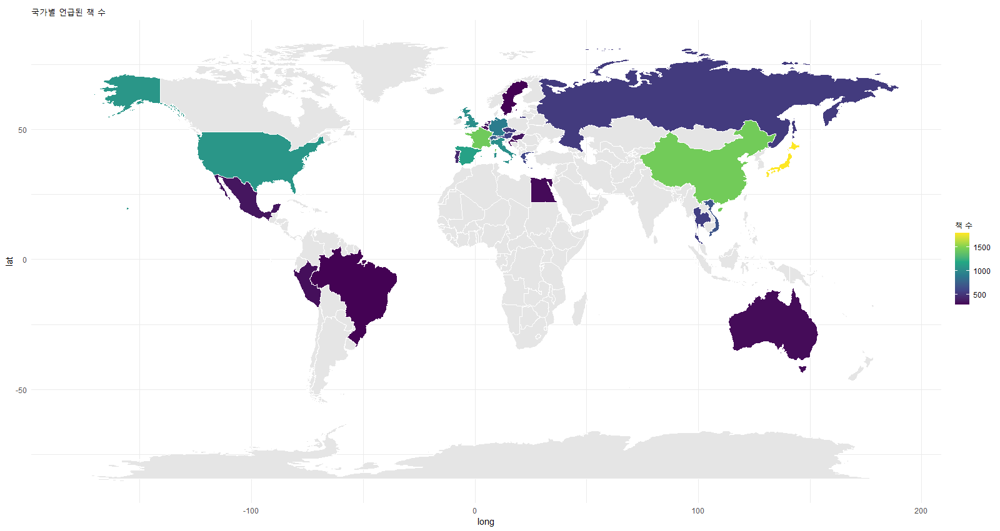
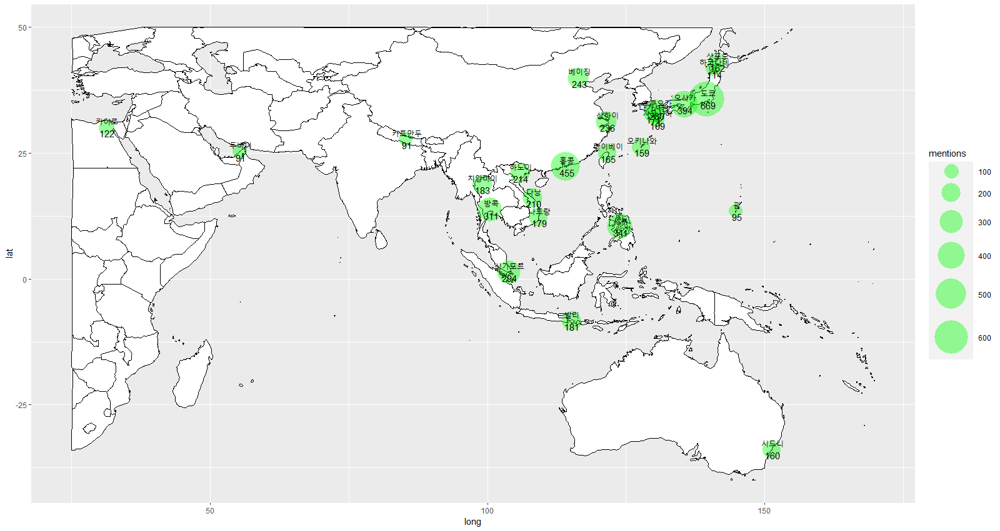
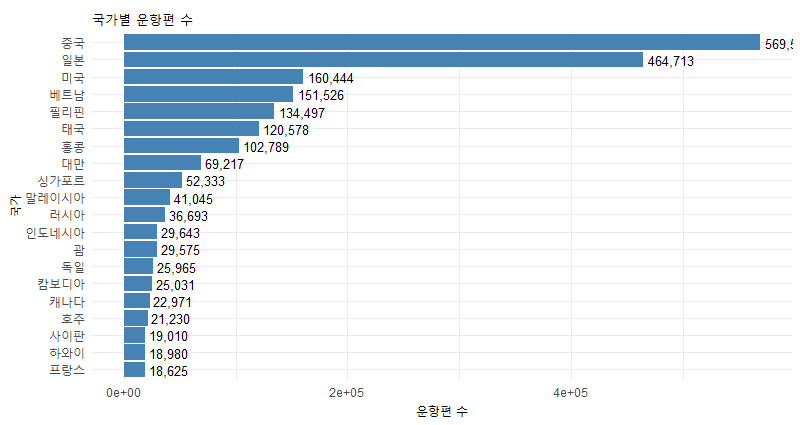
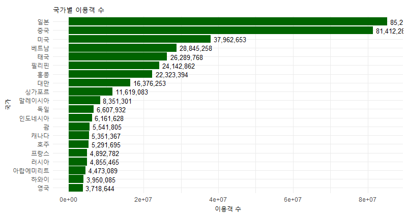

## 1.연도별 출판된 책

##### 1 1989년부터 해외 여행 자유화
##### 2 20,21,22 코로나로 인한 여행 제한

## 2.우리나라 도시 별 언급된 책 수

## 3.국가 별 언급된 책 개수
#### 국가, 도시 데이터프레임

국가 - 수도 + 취항지 + 주관(나폴리, 베네치아 등등)

## 4.전 세계 도시 언급된 책 수

## 5.인천공항 이용 데이터

#### 1.국가별 운항횟수

#### 2.국가별 이용객

