## 1.연도별 출판된 책
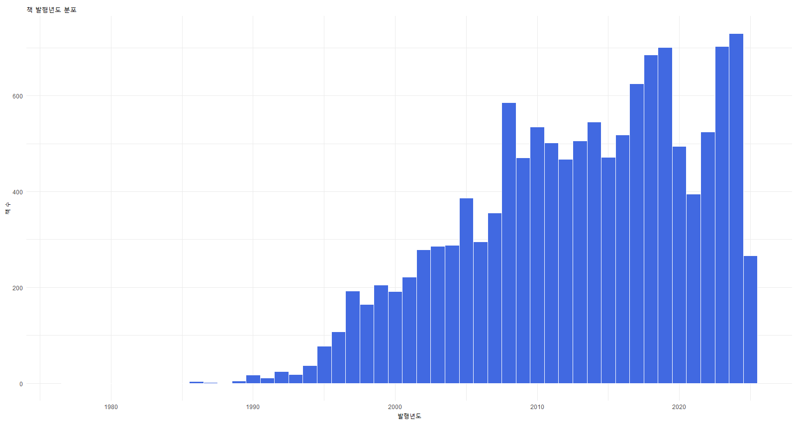
-- 1 1989년부터 해외 여행 자유화  
-- 2 20,21,22 코로나로 인한 여행 제한

## 2.우리나라 도시 별 언급된 책 수
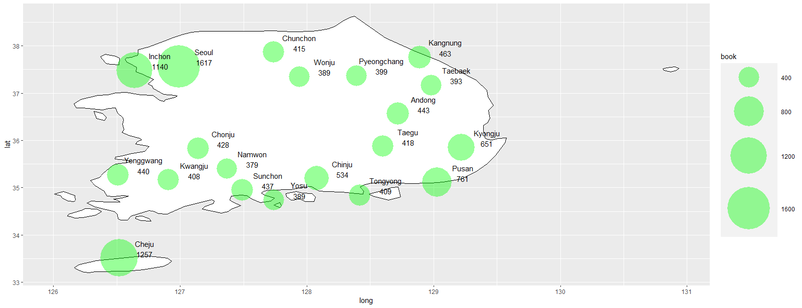

## 3.국가 별 언급된 책 개수
국가, 도시 데이터프레임
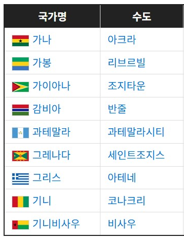
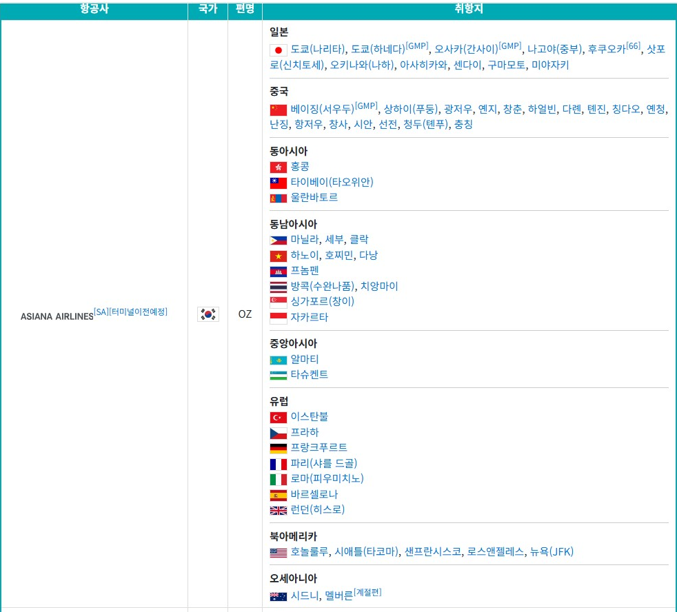
국가 - 수도 + 취항지 + 주관(나폴리, 베네치아 등등)
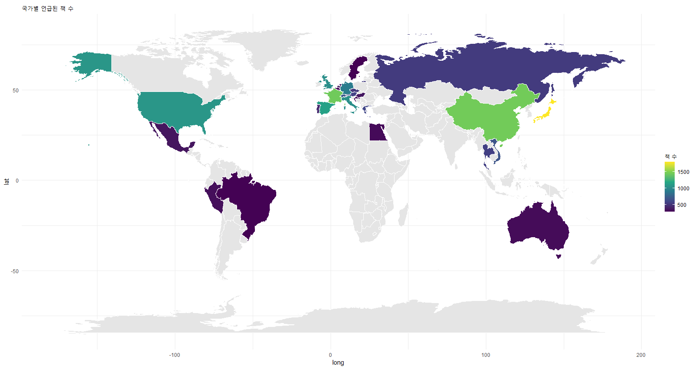
## 4.전 세계 도시 언급된 책 수
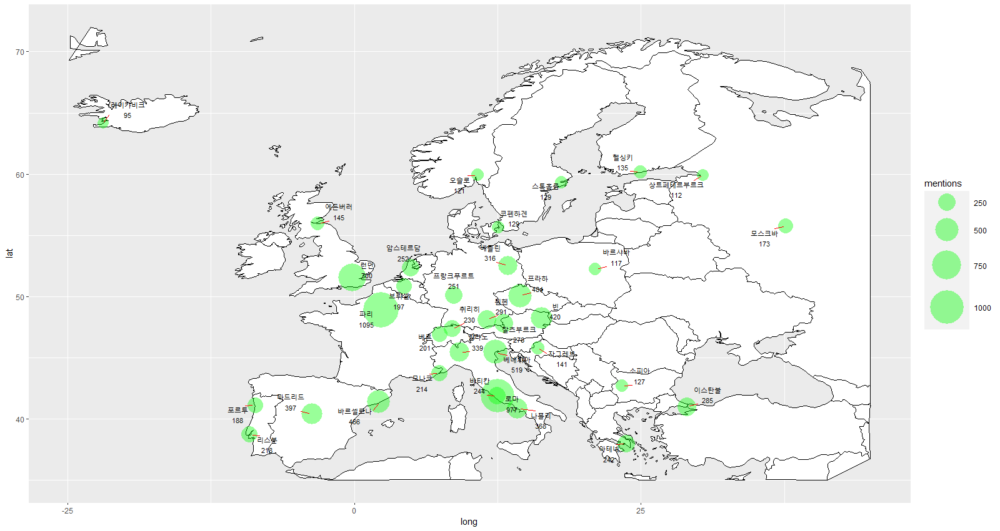
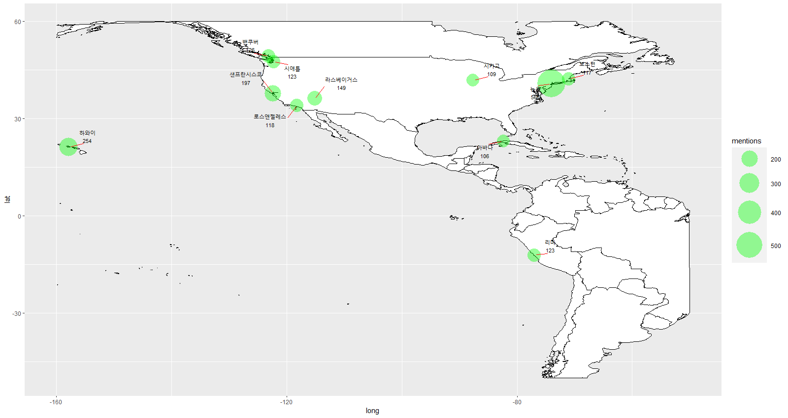

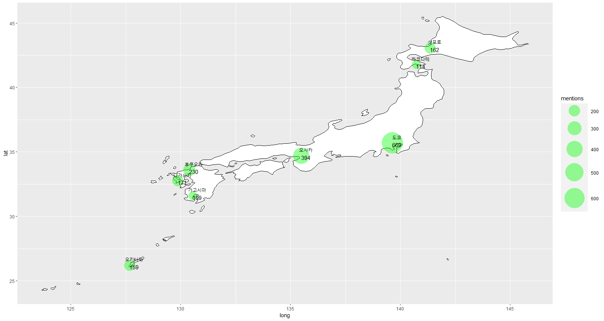

## 5.인천공항 이용 데이터
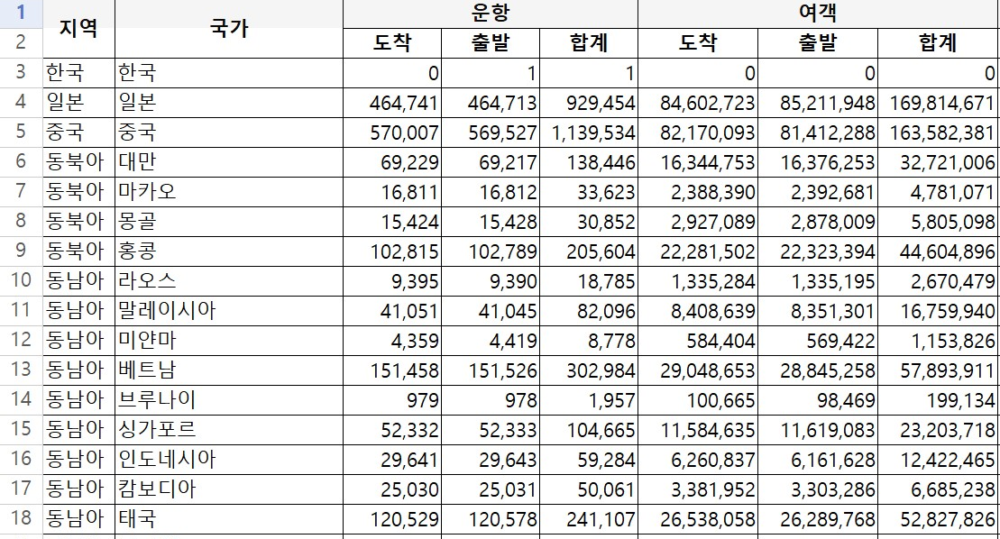
#### 1.국가별 운항횟수
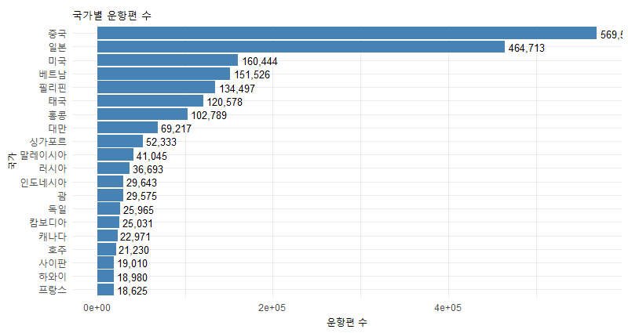
#### 2.국가별 이용객
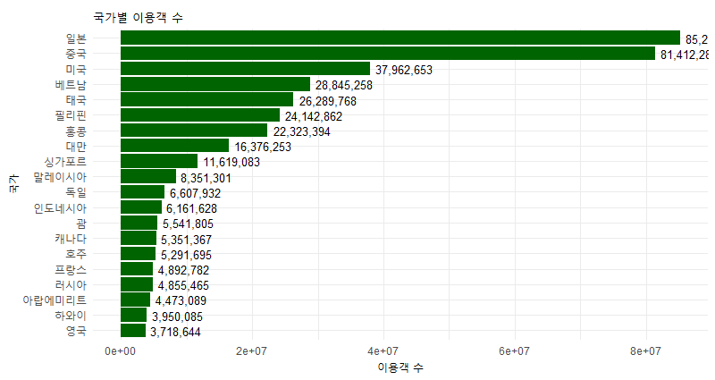
#### 3.도시별 언급 책
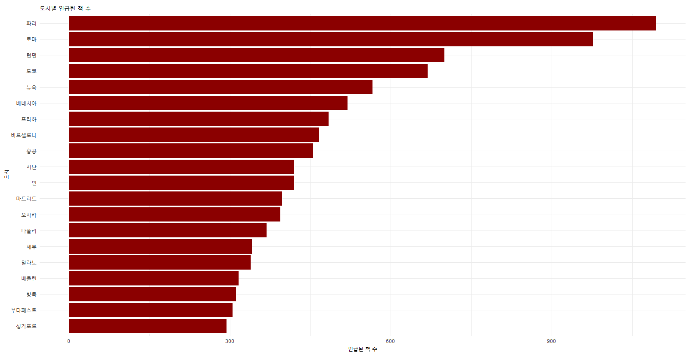

-- 언급된 책도 많고 운항수, 이용객도 많음 -> 일본  
-- 언급된 책은 많은데 운항 수, 이용객 상대적으로 적음 -> 프랑스, 영국  
-- 언급된 책은 적은데 운항 수, 이용객 상대적으로 많음 -> 중국
